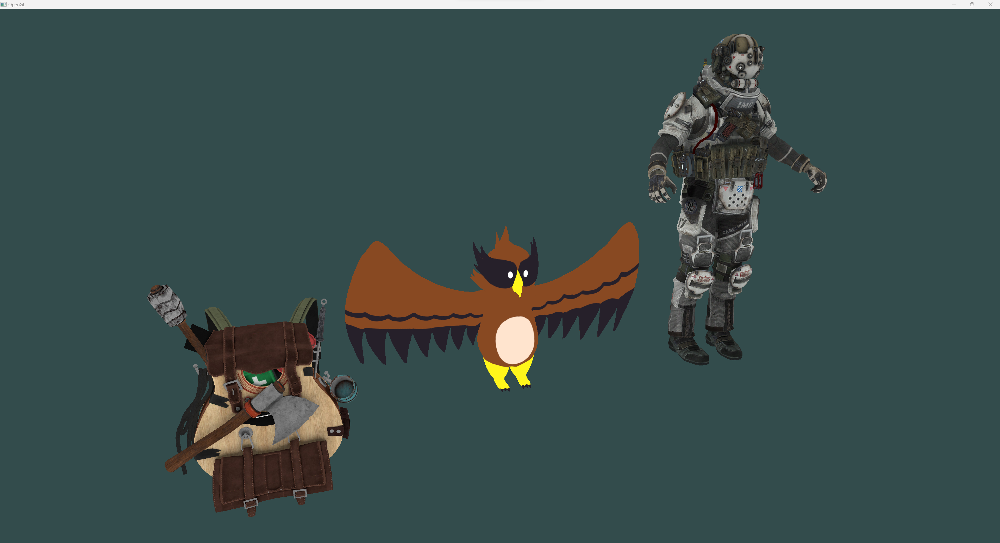
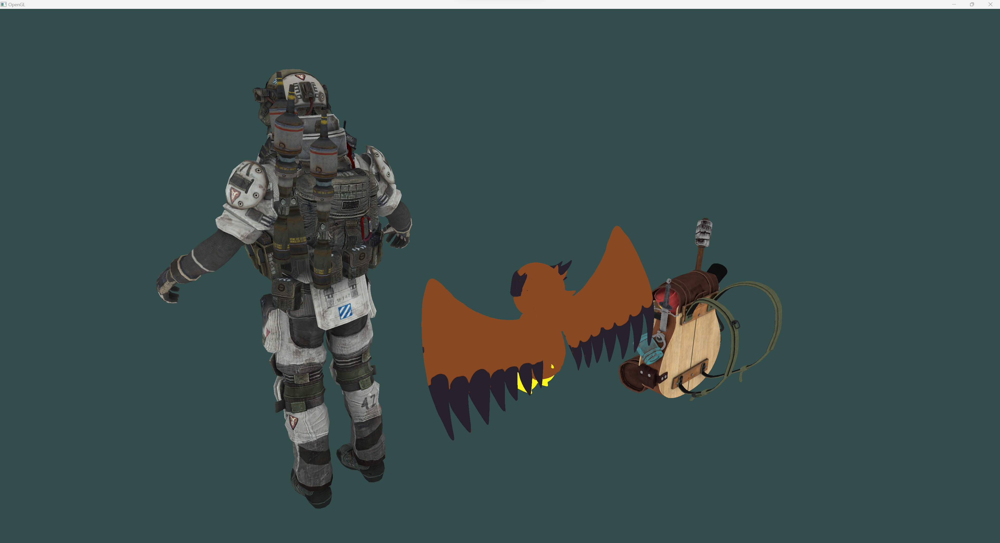

# OpenGL2023

This is my hobby project for learning OpenGL and creating a simple 3D renderer.
Requires Visual Studio 2022.

Note: The IMC grunt model is removed from the project to avoid copyright infringement.

